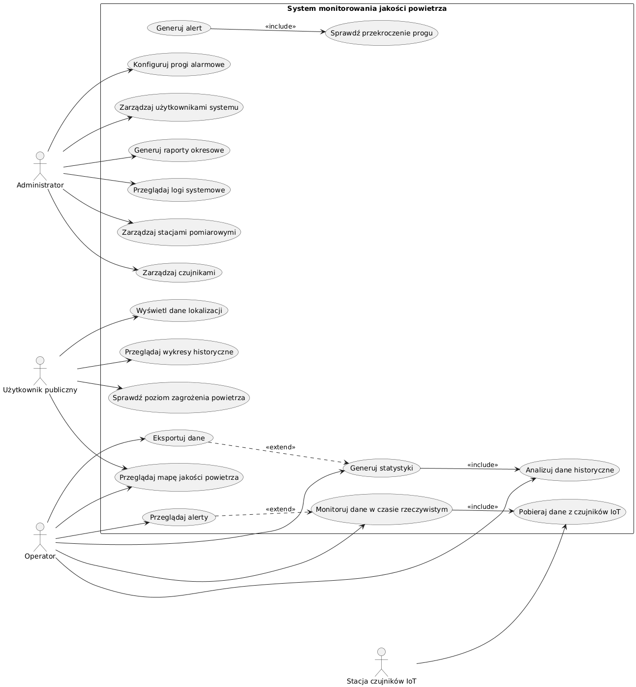
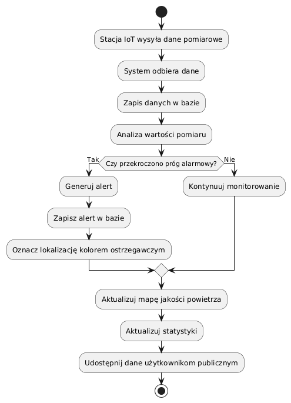
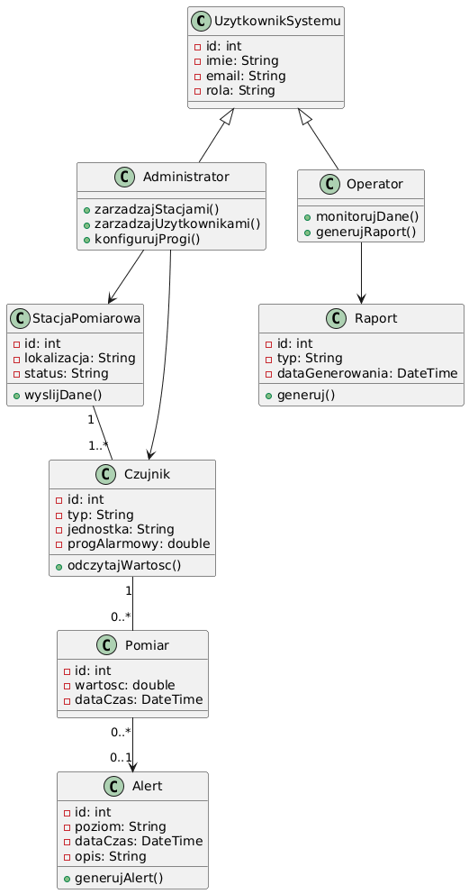

# SPECYFIKACJA ZADANIA PROJEKTOWEGO

## 1. Treść zadania projektowego

Treścią zadania projektowego jest stworzenie systemu informatycznego pod nazwą **System monitorowania jakości powietrza - Platforma wizualizująca dane ze stacji czujników IoT z mapą i statystykami**.  

System będzie służył do gromadzenia, przetwarzania, analizowania oraz wizualizacji danych pochodzących z rozproszonych stacji czujników IoT mierzących parametry jakości powietrza. Platforma umożliwi prezentację danych na mapie, generowanie statystyk oraz analizę historyczną pomiarów.

## 1.2 Przetwarzane dane

Dane, jakie będą przetwarzane w systemie:

- dane stacji pomiarowych (ID stacji, lokalizacja GPS, nazwa lokalizacji, status urządzenia),
- dane czujników IoT (typ czujnika, np. PM2.5, PM10, NO₂, O₃, temperatura, wilgotność),
- dane pomiarowe (wartości pomiarów, data i godzina odczytu, jednostki miary),
- dane statystyczne (średnie dobowe, tygodniowe, miesięczne),
- dane alertów (przekroczenia norm jakości powietrza, czas trwania przekroczenia, poziom zagrożenia).

## 1.3 Cel wdrożenia systemu informatycznego

Cel wdrożenia systemu polega na umożliwieniu bieżącego monitorowania jakości powietrza w wybranym obszarze, szybkiego reagowania na przekroczenia norm oraz udostępniania czytelnych danych mieszkańcom i instytucjom.

---

## 2. Słownik pojęć, definicje, skróty

- **IoT (Internet of Things)** – koncepcja sieci połączonych urządzeń fizycznych, które zbierają i przesyłają dane przez Internet. W systemie IoT odnosi się do stacji pomiarowych wyposażonych w czujniki jakości powietrza.
- **PM2.5 / PM10** – drobne cząstki pyłu zawieszonego w powietrzu o średnicy odpowiednio do 2,5 µm i 10 µm. Są jednym z głównych wskaźników zanieczyszczenia powietrza.
- **O₃ (ozon troposferyczny)** – gaz powstający w wyniku reakcji chemicznych w atmosferze. W nadmiarze działa drażniąco na drogi oddechowe.
- **RWD (Responsive Web Design)** – technika projektowania stron i aplikacji internetowych, dzięki której interfejs dopasowuje się do różnych urządzeń (PC, tablet, smartfon).
- **API (Application Programming Interface)** – interfejs umożliwiający komunikację między systemem a urządzeniami IoT lub zewnętrznymi systemami.
- **Alert** – automatyczne powiadomienie generowane przez system w przypadku przekroczenia ustalonych norm jakości powietrza.
- **Pomiar** – pojedynczy zapis wartości parametru środowiskowego w danym czasie i miejscu.
- **DDoS (Distributed Denial of Service)** – atak komputerowy polegający na przeciążeniu systemu lub sieci przez dużą liczbę równoczesnych żądań z wielu źródeł, co powoduje niedostępność usług dla użytkowników.
- **RBAC (Role-Based Access Control)** – metoda kontroli dostępu w systemach informatycznych, w której uprawnienia do wykonywania operacji przydzielane są użytkownikom na podstawie przypisanej roli (np. Administrator, Operator).

---

## 3. Harmonogram prac – System monitorowania jakości powietrza

| Nr | Zadanie | Czas trwania | Data rozpoczęcia | Data zakończenia | Opis | Odpowiedzialni |
|----|---------|--------------|-----------------|-----------------|------|----------------|
| 1 | Analiza wymagań | 5 dni | 01.01.2026 | 05.01.2026 | Zebranie wymagań funkcjonalnych i niefunkcjonalnych systemu monitorowania jakości powietrza | Analityk |
| 2 | Projekt architektury systemu | 7 dni | 06.01.2026 | 12.01.2026 | Projekt struktury systemu: warstwa IoT, baza danych, backend, frontend | Analityk, programiści |
| 3 | Projektowanie baz danych | 12 dni | 13.01.2026 | 24.01.2026 | Projekt logiczny i fizyczny bazy danych do przechowywania danych z czujników, alertów i statystyk | Analityk, programiści |
| 4 | Implementacja baz danych | 7 dni | 25.01.2026 | 31.01.2026 | Tworzenie schematów baz danych, tabel i relacji oraz integracja z backendem | Programiści |
| 5 | Implementacja backendu i API | 10 dni | 01.02.2026 | 12.02.2026 | Programowanie logiki systemu, pobieranie danych z czujników IoT, generowanie alertów, przygotowanie API dla frontendu | Programiści |
| 6 | Implementacja frontendu i wizualizacji | 8 dni | 13.02.2026 | 22.02.2026 | Tworzenie panelu użytkownika, mapy jakości powietrza, wykresów historycznych i statystyk | Programiści, UI/UX |
| 7 | Testy systemu | 4 dni | 23.02.2026 | 28.02.2026 | Testowanie poprawności działania systemu, poprawność danych, działanie alertów, testy wydajności | Testerzy, programiści |
| 8 | Przygotowanie dokumentacji | 2 dni | 01.03.2026 | 02.03.2026 | Opracowanie dokumentacji użytkownika i technicznej | Analityk |
| 9 | Odbiór systemu | 1 dzień | 03.02.2026 | 03.03.2026 | Formalne zatwierdzenie gotowego systemu przez kierownika projektu | Kierownik |
| 10 | Wdrożenie systemu | 2 dni | 04.03.2026 | 06.03.2026 | Instalacja systemu w środowisku produkcyjnym, konfiguracja stacji pomiarowych i czujników IoT | Administrator, Programiści |

---

## 4. Wymagania funkcjonalne i nie funkcjonalne
## 4.1 Wymagania funkcjonalne
### Dla administratora systemu:

- Dodawanie, edytowanie i usuwanie stacji pomiarowych oraz czujników.
- Konfiguracja progów alarmowych dla poszczególnych parametrów (np. PM2.5).
- Zarządzanie użytkownikami i nadawanie ról dostępu.
- Generowanie raportów okresowych (dziennych, miesięcznych, rocznych).

### Dla operatora systemu:

- Monitorowanie bieżących danych pomiarowych w czasie rzeczywistym.
- Przeglądanie historii pomiarów wybranej stacji.
- Analiza statystyk i trendów jakości powietrza.
- Eksport danych do pliku (np. CSV).

### Dla użytkownika publicznego:

- Podgląd mapy z aktualnym stanem jakości powietrza.
- Sprawdzanie szczegółowych danych dla wybranej lokalizacji.
- Przeglądanie wykresów historycznych.
- Otrzymywanie informacji o poziomie zagrożenia powietrza.

### Funkcje automatyczne:

- Automatyczne pobieranie danych z czujników IoT w odstępach czasu około 5 minut.
- Automatyczne generowanie alertów przy przekroczeniu norm.
- Automatyczne archiwizowanie danych historycznych.

---

## 4.2 Wymagania niefunkcjonalne

- System powinien być dostępny 24/7 z minimalnymi przerwami serwisowymi (w godzinach nocnych).
- System powinien być skalowalny (możliwość dodawania nowych stacji bez utraty wydajności).
- System powinien być odporny na awarie (backup danych, redundancja).
- Czas odpowiedzi systemu nie powinien przekraczać kilku sekund przy standardowym obciążeniu.

---

## 5. Wymagania interfejsowe

- Interfejs w języku polskim.
- Interfejs użytkownika powinien być intuicyjny i przejrzysty.
- Platforma powinna zawierać interaktywną mapę z wizualizacją poziomu jakości powietrza (np. oznaczenia kolorystyczne).
- System powinien umożliwiać wyświetlanie wykresów i statystyk w czytelnej formie graficznej.
- Dostęp do systemu powinien być możliwy z różnych urządzeń (komputer, tablet, smartfon) oraz popularnych przeglądarek internetowych.
- Interfejs powinien być responsywny (RWD).

---

## 6. Wymagania bezpieczeństwa

- Szyfrowanie transmisji danych (protokół HTTPS).
- Szyfrowanie danych wrażliwych w bazie danych.
- Regularne tworzenie kopii zapasowych (backup).
- Ochrona przed atakami typu SQL Injection i DDoS.
- Kontrola dostępu oparta na rolach (RBAC).

---

## 7. Ograniczenia funkcjonalne systemu

### 7.1 Ograniczenia techniczne

- System jest uzależniony od poprawnego działania stacji pomiarowych i czujników IoT - w przypadku awarii urządzenia dane nie będą dostępne.
- Częstotliwość aktualizacji danych zależy od konfiguracji czujników oraz przepustowości łącza internetowego.
- System może obsługiwać jedynie czujniki zgodne z określonym protokołem komunikacyjnym (np. poprzez API REST lub MQTT).

### 7.2 Ograniczenia danych

- Dokładność prezentowanych wyników zależy od jakości i kalibracji czujników.
- System nie koryguje automatycznie błędnych danych pomiarowych - może jedynie je oznaczać jako potencjalnie nieprawidłowe.
- Dane historyczne mogą być archiwizowane po określonym czasie, co może ograniczać dostęp do bardzo starych pomiarów w trybie online.

### 7.3 Ograniczenia użytkowe

- Użytkownik publiczny ma dostęp wyłącznie do danych odczytowych i statystyk - bez możliwości edycji lub ingerencji w dane źródłowe.
- Administratorzy i operatorzy mają dostęp do funkcji zarządzania systemem wyłącznie w zakresie przypisanych ról.
- System wymaga dostępu do Internetu - brak połączenia uniemożliwia korzystanie z platformy.

### 7.4 Ograniczenia prawne i środowiskowe

- System musi działać zgodnie z obowiązującymi normami dotyczącymi ochrony danych osobowych (np. RODO).
- Publikowane dane muszą być zgodne z aktualnymi normami jakości powietrza określonymi przez odpowiednie instytucje krajowe lub unijne.
- System nie zastępuje oficjalnych pomiarów certyfikowanych laboratoriów - dane mają charakter informacyjny i wspomagający.

---

## 8. Dalsza ewolucja systemu

System będzie rozwijany i rozszerzany o nowe funkcjonalności, takie jak:

- integracja z aplikacją mobilną,
- integracja z otwartymi bazami danych środowiskowych (np. krajowymi systemami monitoringu),
- wykorzystanie algorytmów predykcyjnych do prognozowania poziomu zanieczyszczeń,
- integracja z systemami Smart City,
- migracja do chmury obliczeniowej w celu zwiększenia dostępności, skalowalności i redukcji kosztów utrzymania.

---

## 9. Diagram przypadków użycia

## 10. Diagram aktywności

## 11. Diagram klas

